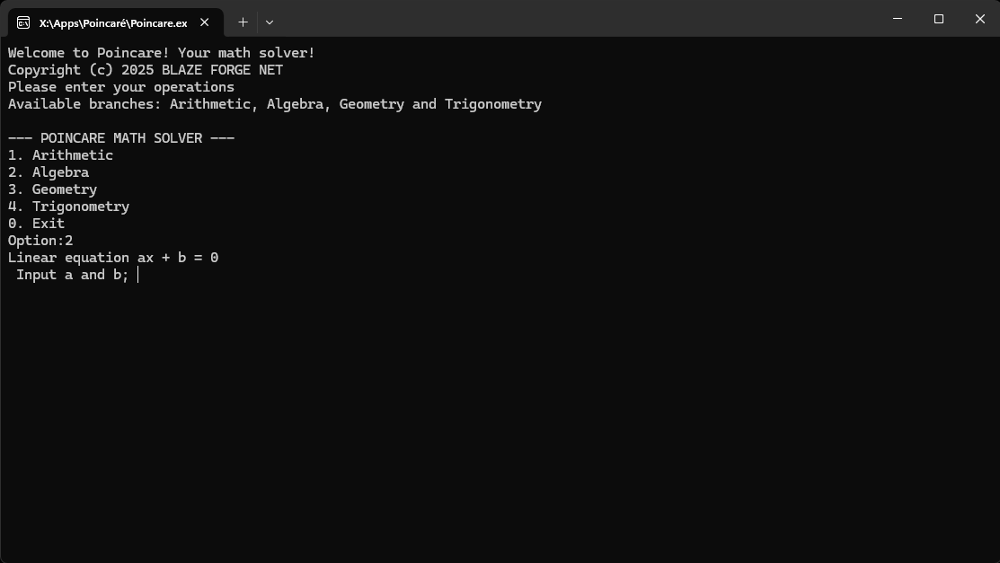
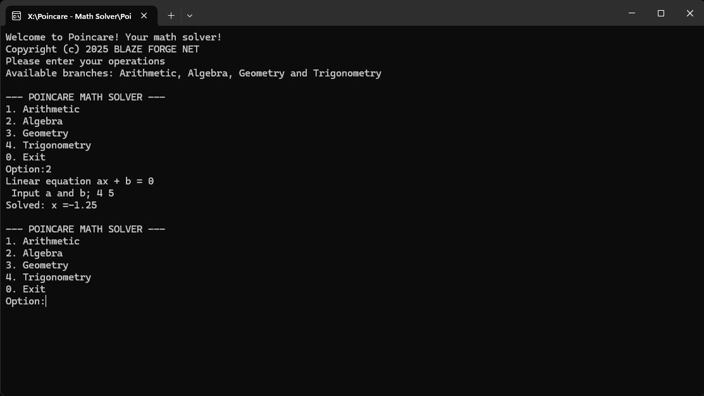
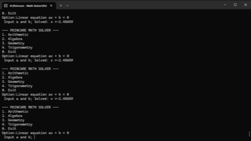

# POINCARE - THE MATH SOLVER

This is a mathematics solver, free for personal use and students. Contains just 4 branches. I'll be adding more later; this is just a basic solo project. Completely portable and lightweight.

UI not included. 

## HOW TO USE:

Open the executable, and there are four options to use. Press the assigned keys and input your operations:

For the algebra option, just write the numbers separately just like this:

## FOR LINUX USERS.
First of all, you must have **g++** installed (very Linux distro must have this by default). If you don't have it, just do this:
* `sudo apt update`
* `sudo apt install g++`

## FOR ANDROID USERS.
Poincaré doesn't have a user interface; it's just for console use. You must install third-party apps like **Termux** (recommended download for **F-Droid**; the Play Store app version is obsolete).

Use these commands:

* `pkg update`
* `pkg install clang`
* `clang++ poincare.cpp -o poincare`

## BUGS
There is a bug that causes that, when entering the variable (4x), the result is partially illegible and is duplicated. That entry is not recommended at the moment; I'll be fixing it later. Remember to enter the numbers separately, not variables.

## SUPPORT ME 

[Donate via PayPal](https://paypal.me/hugof390)

